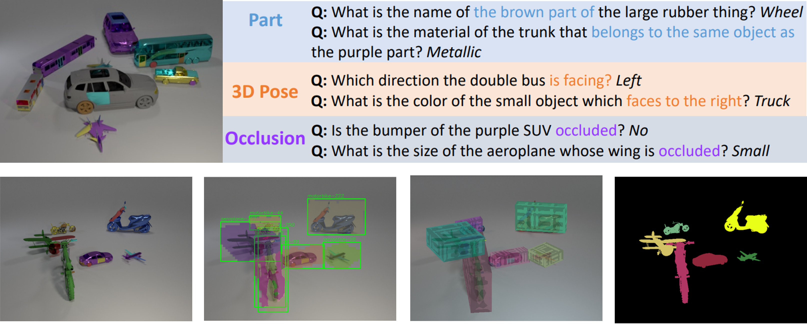

<h1 align="center"> 
    <a href='https://arxiv.org/abs/2310.17914'>3D-Aware Visual Question Answering about Parts, Poses and Occlusions (NeurIPS 2023)
    </a>
</h1>
<h4 align="center">
    <a href='https://arxiv.org/abs/2310.17914'>Xingrui Wang</a>,
    <a href='https://wufeim.github.io/'>Wufei Ma</a>,
    <a href='https://lizw14.github.io/'>Zhuowan Li</a>,
    <a href='https://gvrl.mpi-inf.mpg.de/'>Adam Kortylewski</a>,
    <a href='https://www.cs.jhu.edu/~ayuille/'>Alan Yuille</a>
</h4>
<p align="center">
    <a href='https://arxiv.org/abs/2310.17914'>Arxiv</a> / 
    <a href='https://github.com/XingruiWang/superclevr-3D-question'>Dataset</a> /
    <a href='https://github.com/XingruiWang/3D-Aware-VQA?tab=readme-ov-file#citation'>Bibtex</a>
</p>

<div align="center">
    
</div>

## Description
This is the implementation of the NeurIPS'23 paper "3D-Aware Visual Question Answering about Parts, Poses and Occlusions". This paper contains two parts:

1. **Super-CLEVR-3D**. A compositional reasoning dataset that contains questions about object parts, their 3D poses, and occlusions. $\rightarrow$ [`./superclevr-3D-question`](https://github.com/XingruiWang/superclevr-3D-question/tree/main)
2. **PO3D-VQA**. A 3D-aware VQA model, combining 3D generative representations of objects for robust visual recognition and probabilistic neural symbolic program execution for reasoning. $\rightarrow$ [`./PO3D-VQA`](https://github.com/XingruiWang/3D-Aware-VQA/tree/master/PO3D-VQA)

## Citation
```
@article{wang20233d,
  title={3D-Aware Visual Question Answering about Parts, Poses and Occlusions},
  author={Wang, Xingrui and Ma, Wufei and Li, Zhuowan and Kortylewski, Adam and Yuille, Alan},
  journal={arXiv preprint arXiv:2310.17914},
  year={2023}
}
```
